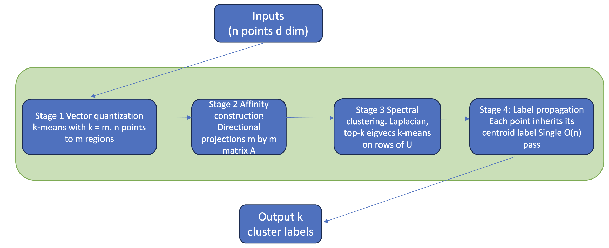
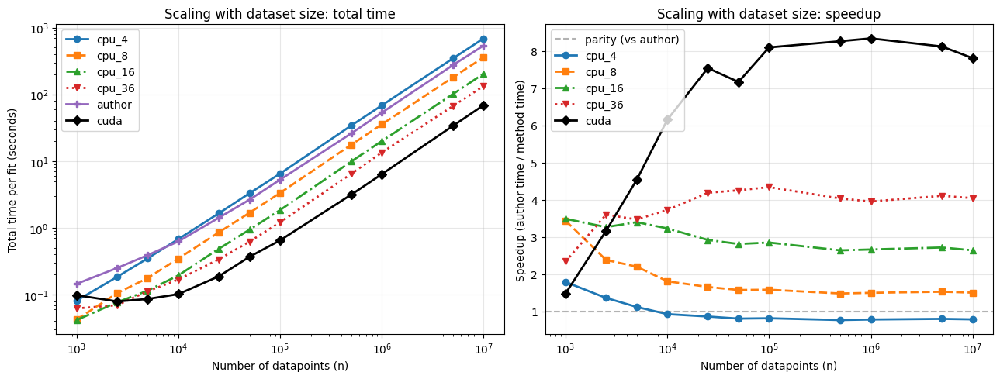
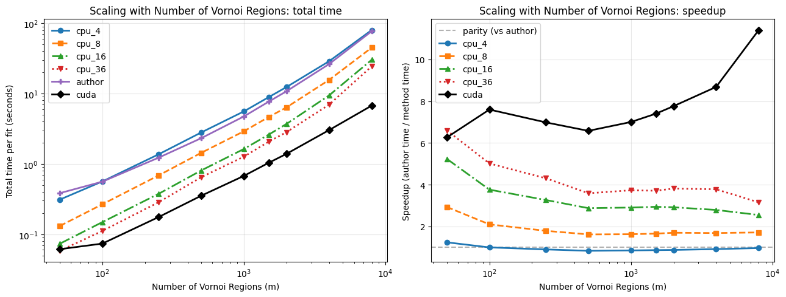
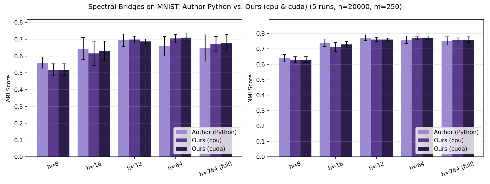
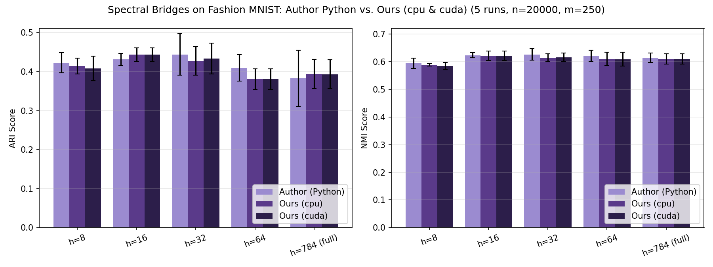
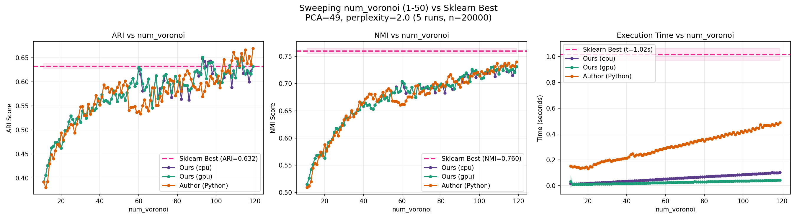
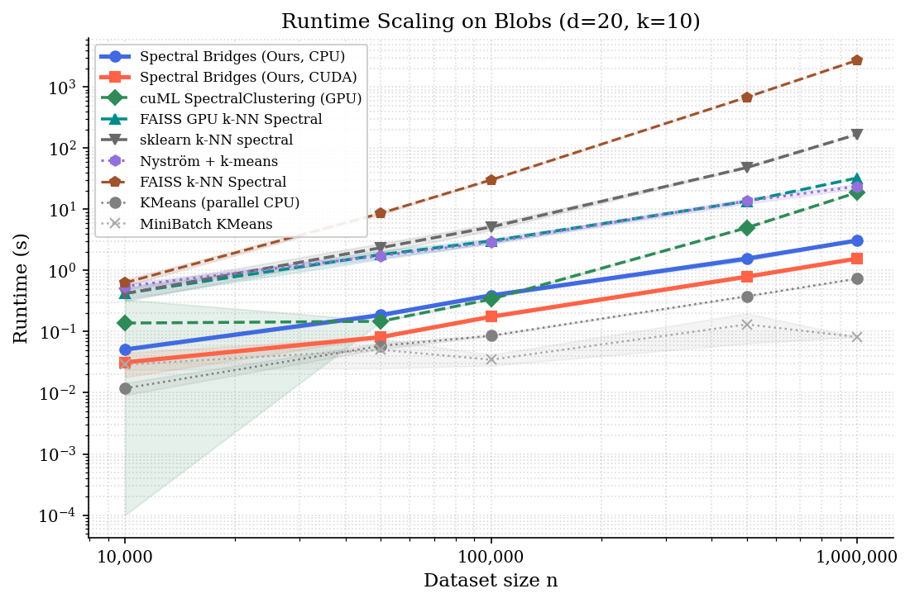
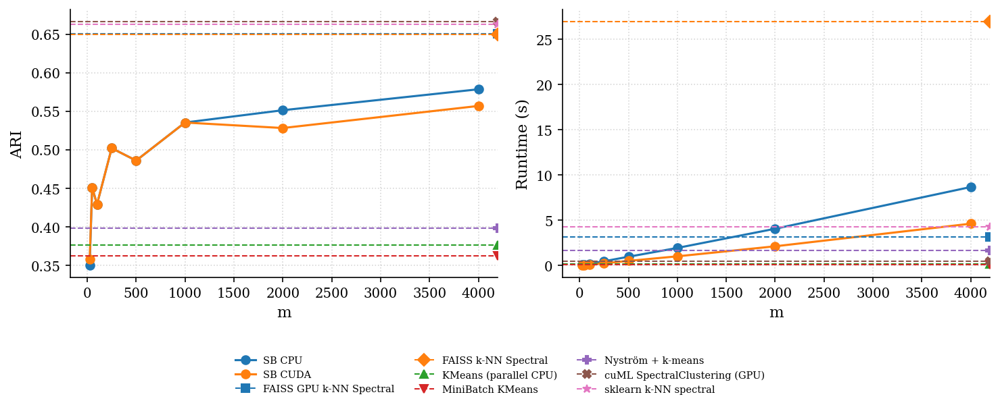

# Spectral Bridges

A parallel (CPU + CUDA) implementation of **Spectral Bridges**, a spectral clustering
method that scales to large datasets by clustering *Voronoi regions* instead of
individual points. K-Means first partitions the data into a small number of
regions ("bridges"); an affinity graph is built between region centroids; and
spectral clustering runs on that much smaller graph. This avoids constructing
and eigendecomposing an O(n²) affinity matrix, so it scales to datasets far
larger than plain spectral clustering can handle, while staying close to it in
cluster quality.

The core algorithm is implemented in C++/CUDA for performance, with a
`pybind11` extension module (`specbridge`) exposing it to Python. Directional
affinity construction — the pipeline's hot spot — is reframed as a batched
per-region GEMM problem mapped onto `cublasSgemmStridedBatched`, with the
eigendecomposition on `cuSOLVER` and all intermediate state kept
device-resident.

<p align="center">
  
</p>

## Results

<div align="center">

| | |
|---|---|
| **~8×** speedup vs. Python | GPU, at n = 10,000,000 points |
| **~12.6×** speedup vs. Python | GPU, at m = 8,000 Voronoi regions |
| **~18×** speedup vs. Python | GPU, converging to sklearn's ARI/NMI at m ≈ 70 |
| **ARI / NMI within error bars** | vs. Python reference, on MNIST & Fashion-MNIST |

</div>

### Scaling

<p align="center">
  
  
</p>

GPU speedup stabilizes at **~8×** for `n ≥ 10⁵` (36-thread CPU plateaus at ~4×,
memory-bandwidth bound), and grows monotonically with `m`, reaching **12.6×**
at `m = 8,000` since larger `m` exposes more parallel work to the batched GEMM.

### Clustering quality is preserved

<p align="center">
  
  
</p>

CUDA, OpenMP-CPU, and the original Python implementation overlap within error
bars across every tested PCA dimension `h ∈ {8, 16, 32, 64, 784}`.

### Convergence to full spectral clustering

<p align="center">
  
</p>

Sweeping `m` from 11 to 119 at fixed `n = 20,000`: quality rises steeply and
stabilizes near the sklearn spectral-clustering reference (ARI = 0.632,
NMI = 0.760) by `m ≈ 70` — reached in 0.03s on GPU vs. 0.54s for the Python
reference (**18×**), with no further quality gain from larger `m`.

<details>
<summary><b>vs. other state-of-the-art clustering libraries</b> (FAISS, cuML, sklearn k-NN spectral, Nyström + k-means)</summary>
<br>

<p align="center">
  
  
</p>

Spectral Bridges offers a tunable accuracy/speed tradeoff — low `m` for fast
approximations, higher `m` approaching full spectral-clustering accuracy —
with a simpler, unified pipeline. Some highly optimized libraries (e.g. FAISS)
remain faster in absolute terms at small scale, but Spectral Bridges scales
more predictably as `n` and `m` grow.

</details>

## Repository layout

```
spectral-bridges/
  include/            Public headers (K-Means, affinity graph, spectral clustering)
  src/                Core C++/CUDA implementation
  python/bindings.cpp pybind11 bindings exposing the C++ core as the `specbridge` Python module
main.cpp              Minimal C++ smoke test of the end-to-end pipeline
tests/                C++ unit tests + reference fixtures (data + expected metrics)
scripts/
  benchmarks/         CPU vs. GPU speed/scaling benchmarks
  evaluation/         Clustering quality evaluation (vs. K-Means, on MNIST, etc.)
  tuning/             Hyperparameter search (Optuna) for the sklearn baseline
  plotting/           Plot generation for benchmark results
slurm/                SLURM job scripts used to run builds/benchmarks on a GPU cluster
notebooks/            Notebooks used for implementation testing/validation
results/              Benchmark outputs: architecture diagram, scaling curves, sweeps,
                      MNIST/Fashion-MNIST reproductions, SOTA comparisons
```

## Building

Requires CMake ≥ 3.20, a C++17 compiler, the CUDA Toolkit, Eigen3, OpenMP,
[Spectra](https://spectralib.org/) (header-only), and `pybind11`. On Linux,
OpenBLAS + LAPACKE are used if available; on macOS, Apple's Accelerate
framework is used instead.

```bash
cmake -B build -DCMAKE_BUILD_TYPE=Release
cmake --build build --config Release
```

This produces:
- `spectral_bridges` — a small C++ executable running the pipeline on synthetic data
- `specbridge` — the Python extension module
- `test_kmeans`, `test_kmeans_cuda`, `test_reference` — C++ test binaries

## Python usage

```python
import numpy as np
import specbridge

X = np.random.rand(10000, 32).astype(np.float32)

sb = specbridge.SpectralClustering(
    n_clusters=10,
    num_voronoi=200,   # number of K-Means regions used as graph nodes
    use_gpu=True,      # run the K-Means/affinity stages on CUDA
)
result = sb.fit(X)

result.labels                 # per-point cluster labels
result.cluster_point_indices  # points grouped by cluster
result.ngap                   # normalized eigengap (cluster separation quality)
```

## Testing

```bash
ctest --test-dir build
```

`tests/generate_reference.py` regenerates the reference fixtures under
`tests/data/` used by `test_reference`.

## Benchmarks

See [Results](#results) above for the headline numbers. The
benchmarks themselves live in `scripts/benchmarks/` and
`scripts/evaluation/`, which compare the CPU and CUDA implementations
against each other and against scikit-learn, across dataset size (`n`),
number of regions (`m`), and on MNIST/Fashion-MNIST; raw outputs and plots
are in `results/`.
